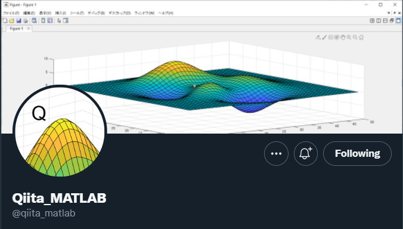

# "今日"投稿された Qiita 投稿の Tweet
Copyright (c) 2022 Michio Inoue.

GitHub Actions を使用して、過去 Qiita に投稿された MATLAB/Simulink 関連の記事を [@qiita_matlab](https://twitter.com/qiita_matlab)
から呟きます。

新着の記事を呟く仕組みはこちらで解説しています。
- Qiita: [MATLAB タグ付きの新着投稿をお知らせする Twitter bot (Powered by ThingSpeak)](https://qiita.com/eigs/items/412cd57f0cf5aa5ac5ae)

## Action 1: 全投稿を取得

getAllQiitaArticles.m を年に一度（年初）に実行してそれまでに投稿された
Qiita 記事のリストを作成します。[Qiita API](https://qiita.com/api/v2/docs) を使用します。
getAllQiitaArticles.yml を参照。

## Action 2: 過去の投稿を Tweet

tweetOnThisDayPost.m を 4 時間に一度実行し、過去の同じ日時に投稿された記事を [@qiita_matlab](https://twitter.com/qiita_matlab)
から呟きます。[ThingTweet](https://jp.mathworks.com/help/thingspeak/thingtweet-app.html) を使用します。tweetOnThisDayPost.yml を参照

## 環境

 - MATLAB R2022a (Toolbox 不要)
 - ThingSpeak アカウント

 

